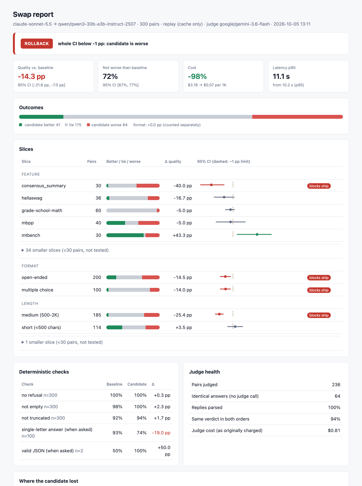
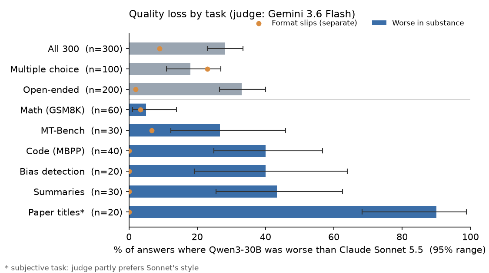
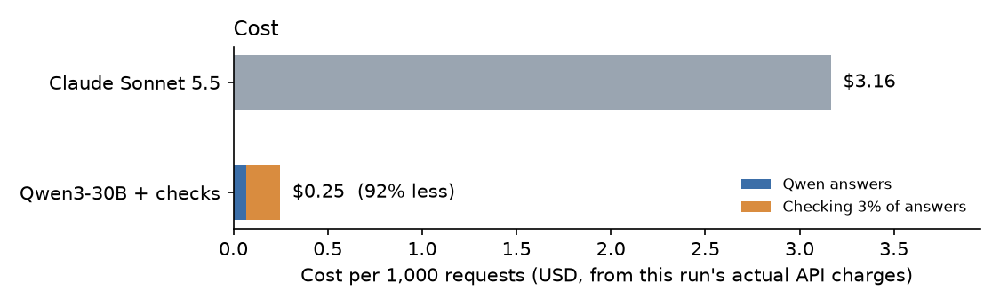

# safeswap

Check how much quality you lose when you switch to a cheaper LLM setup.

It sends a small share of requests to the original model too, has a judge compare the two
answers, and reports the error rate with a range. For example, Qwen3-30B against Claude
Sonnet 5.5 on 300 prompts:

```
worse in substance:  28%  [23%, 33%]
format slips:         9%  [6%, 13%]
cost:               -92%  (with 3% of answers checked)
```

It can also pick a routing threshold that stays under an error budget, and alert you when quality
drops later.

## Swap report

Replay logged requests through a candidate model and get a ship / hold / rollback / split
verdict, with a breakdown by slice:

```bash
safeswap replay --logs traces.jsonl --candidate qwen/qwen3-30b-a3b-instruct-2507 \
    --judge google/gemini-3.6-flash --policy examples/policy.yaml
safeswap report runs/replay-<time> --open
```



Logs can be sessions with full turn history or OpenAI-style `{"messages": ..., "response": ...}`
lines; each turn keeps its real history and only the candidate's reply is new.
`safeswap fetch wildchat` downloads real conversations to try it on. The report above was
rebuilt from the cached 300-prompt live test with `--cache-only`, so it cost nothing to produce.

## How it works

1. **Serve.** Each request goes to the cheap or the expensive model, depending on your setup
   (cheaper model, router or cache).
2. **Sample.** A small random share of cheap-model requests (1-3% is usually enough) is also sent
   to the expensive model. Each request's chance of being picked is recorded.
3. **Judge.** A judge model compares the two answers twice, swapping their order so it doesn't
   favour whichever comes first. It gives separate verdicts for substance and for formatting, so a
   stray "A)" instead of "A" doesn't count as a wrong answer.
4. **Estimate.** Each checked request stands in for the unchecked ones it represents (one checked
   at 3% counts about 33 times). You get the error rate with an honest range instead of a guess,
   and savings after the cost of checking.
5. **Calibrate.** To pick a router threshold, it tries thresholds from safest to cheapest and stops
   at the first one it can't prove is under your error budget. In testing, picking by eye
   overshot a 2-5% budget about half the time; the calibrated threshold held in 95%+ of cases.
6. **Watch.** A running counter adds up the judge results and raises an alarm when errors climb.
   This catches a provider silently swapping the model behind an endpoint, which input
   monitoring missed 98% of the time in testing (safeswap caught 97%). On an alarm you fall back
   to the expensive model, collect fresh checks and recalibrate.

## A live test

300 prompts (200 open-ended, 100 multiple choice): Qwen3-30B against Claude Sonnet 5.5, judged
by Gemini 3.6 Flash. Cost about $2.





- On subjective tasks like paper titles, the judge partly rewards Sonnet's style, so treat
  open-ended numbers as an upper bound.
- Separating format from substance took the judge's agreement with known answers from 64% to 94%.
- Check the judge first: Gemini 3.6 Flash returned empty replies until it had room to reason.

## Usage

Install:

```bash
uv sync --extra data --extra embed
```

Run an experiment from a config file. Results go to `runs/<name>-<time>/` (event log, summary and
a text report):

```bash
uv run safeswap run experiments/00_smoke.yaml
```

Re-print the report for an earlier run:

```bash
uv run safeswap report runs/<dir>
```

See how many checked requests you need before you can claim the error is under a budget:

```bash
uv run safeswap sample-size --alpha 0.02
```

A config looks like this:

```yaml
name: smoke
mode: offline              # offline replays a dataset; live calls real models
models:
  small: mistralai/mixtral-8x7b-chat
  large: gpt-4-1106-preview
dataset:
  n: 20000                 # requests to replay
  calib_frac: 0.2          # share used to fit the router
policy:
  kind: segment_prior      # always_small, random_mix, oracle, segment_prior, learned_gate
  threshold: 0.9
shadow:
  mode: uniform            # or active
  rate: 0.03               # share of cheap-model answers to check
```

Offline mode makes no API calls. For live mode, put `OPENROUTER_API_KEY` in `.env` and add a
judge model and a spending limit to the config:

```yaml
mode: live
spend_cap_usd: 0.50
models:
  small: qwen/qwen3-30b-a3b-instruct-2507
  large: anthropic/claude-sonnet-5.5
  judge: google/gemini-3.6-flash
```

The `experiments/` folder also has standalone scripts, e.g.
`uv run python experiments/04_drift.py` to compare drift detectors.

## Code

```
src/safeswap/
  data/      traces, WildChat and RouterBench loaders, run export
  llm/       OpenRouter client (exact cost, spend cap, cache-only mode), call cache
  scoring/   pairwise judge, deterministic checks
  stats/     estimators, paired comparisons, sampling, drift, calibration
  routing/   routers under test and their features
  monitor/   estimate realised error from a shadowed sample
  replay/    replay engine, analysis, decision policy, text/JSON/HTML reports
```

Data: [RouterBench](https://huggingface.co/datasets/withmartian/routerbench) and
[WildChat-1M](https://huggingface.co/datasets/allenai/WildChat-1M) (ODC-BY) are downloaded at
runtime and not included here.
